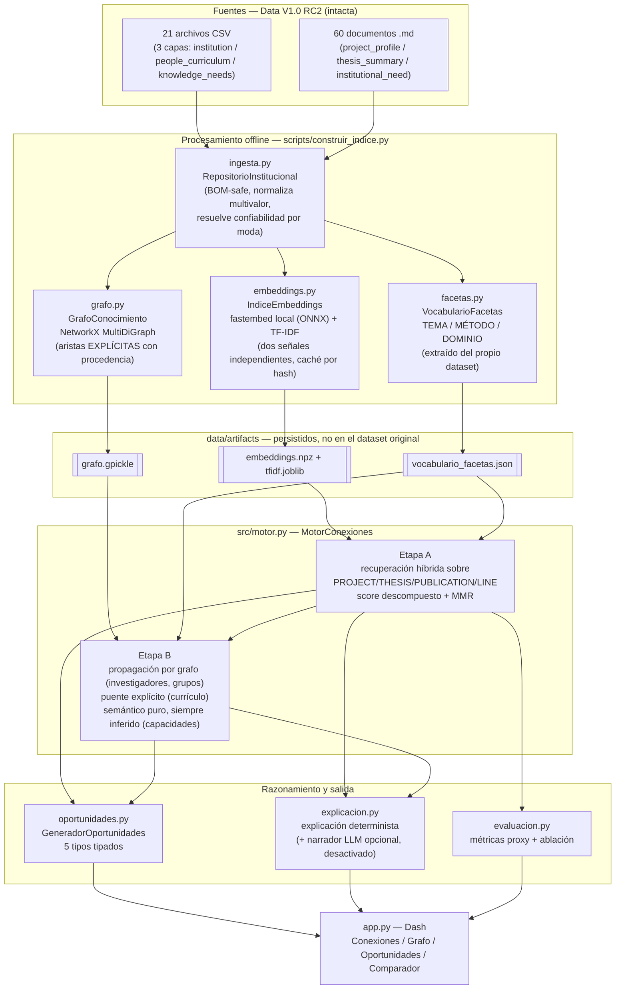
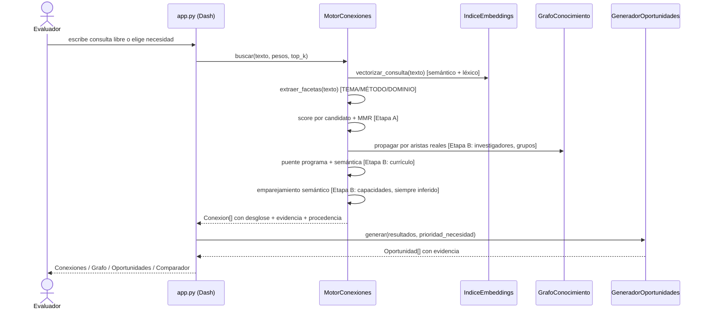

# Arquitectura

Diagrama de **lo realmente implementado** (no una arquitectura aspiracional).
Corresponde 1:1 a los módulos en `src/`.

## Flujo de una consulta en vivo (no offline)

## Por qué estas decisiones

- **Grafo persistido aparte del dataset**: Data V1.0 se conserva intacta
  (requisito §9 del Documento Técnico); todo lo derivado vive en `data/`.
- **Dos señales de vectorización simultáneas** (semántica local + léxica TF-IDF),
  no una con fallback silencioso a la otra: cada una aporta una parte del score
  visible, y si el motor semántico no está disponible en la máquina, su peso se
  redistribuye explícitamente sobre el léxico (`MotorConexiones._pesos_efectivos`),
  documentado y probado (`tests/test_motor.py::test_degradacion_controlada_sin_motor_semantico`).
- **Aristas explícitas vs. inferidas nunca se mezclan**: cada arista del grafo trae
  `naturaleza` y `procedencia`; el motor solo añade aristas inferidas en tiempo de
  consulta, nunca las persiste como si fueran parte del dataset original.
- **UI**: el grafo interactivo se implementó primero con `dash-cytoscape`, pero en
  las pruebas de este entorno el widget no compositaba nada en el canvas (verificado
  con un ejemplo mínimo oficial de la librería, cero relación con la lógica de la
  app). Se sustituyó por un grafo de red con Plotly + NetworkX (`spring_layout`),
  que ya es dependencia de Dash y renderiza de forma confirmada (SVG, no canvas).
